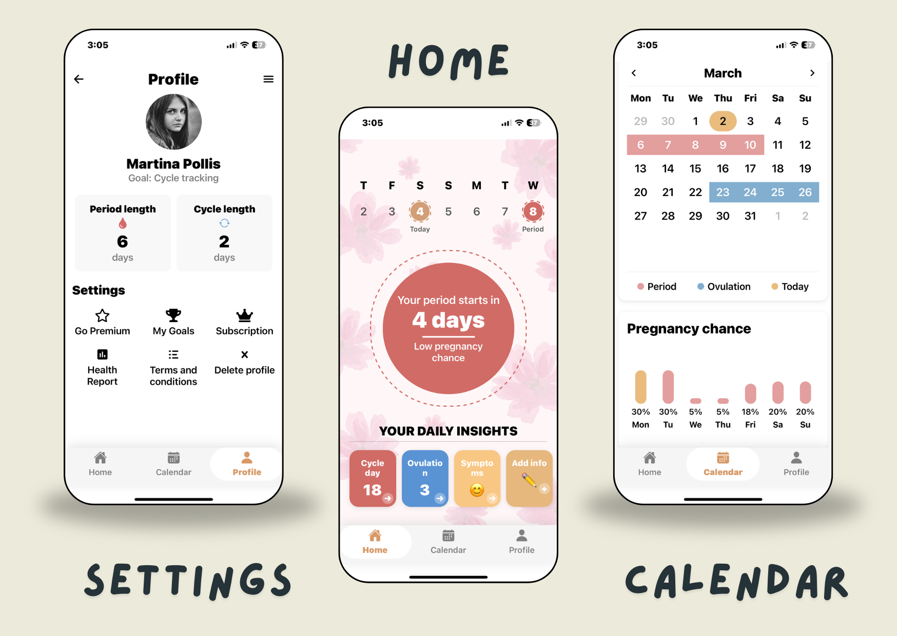

# FloraFlow – A Period Calendar 

**FloraFlow** is a smart and elegant period tracking calendar built to help users understand and manage their reproductive health better. Designed with empathy and built with modern tools, Sihana offers free access to pro features, educational insights, and a smooth onboarding journey.

---

## Table of Contents

- [About](#about)
- [Features](#features)
- [Tech Stack](#tech-stack)
- [Getting Started](#getting-started)
- [Usage](#usage)
- [Screenshots](#screenshots)
- [Roadmap](#roadmap)
- [Contributing](#contributing)
- [License](#license)
- [Contact](#contact)

---

## About

FloraFlow provides a personalized experience to track menstrual cycles, symptoms, and reproductive health disorders. With an intuitive interface and cloud sync, it ensures your data is always safe, accessible, and insightful.

---

## Features

- 🚀 Expo-powered cross-platform app  
- 🔐 Username + Password Authentication  
- 📅 Cycle & symptom logging calendar  
- 👩‍⚕️ Reproductive health disorder tracker  
- 📈 Visual insights and progress bars  
- ✅ Smooth onboarding flow with completion screen  
- ☁️ Node.js + MongoDB backend for sync (WIP)  
- 🌓 Dark mode support  
- 📱 Ready for real-world deployment  

---

## Tech Stack

- **Framework:** React Native (Expo)  
- **Backend:** Node.js + Express  
- **Database:** MongoDB  
- **Auth:** Username & Password (Custom API)  
- **Storage:** AsyncStorage  
- **State Management:** React Context API  
- **Deployment:** Expo Go / Web (WIP)

---

## Getting Started

### Prerequisites

- Node.js  
- Expo CLI  
```bash
  npm install -g expo-cli
```

### Installation
```bash
   git clone https://github.com/your-username/Sihana.git
   cd Sihana - A Period Calendar
   npm install
   npx expo start
```
### Usage
- Launch the app using Expo Go on your mobile
- Sign up or log in using your username & password
- Go through the onboarding screens:
- Regularity of cycle
- Symptoms
- Health disorders
- Period logging
- Completion screen
- Get redirected to your personal dashboard

---

## Screenshots

### WELCOME
   

### MAIN TABS
   
   


## Roadmap
- Complete backend integration
- Role-based login for future upgrades
- Add AI-based prediction features
- Deploy web version of Sihana
- Add monthly & weekly health reports
- Push notifications for reminders

---

## Contributing

We’d love your support!
```bash
   # Fork the repo
   # Create a feature branch
   git checkout -b feature-branch

   # Make changes and commit
   git commit -m "Added a new feature"

   # Push and create PR
   git push origin feature-branch
```

### License

This project is licensed under the MIT License – see the LICENSE file for details.

---

### Contact

📧 trock3338@gmail.com

🔗 www.linkedin.com/in/aman-singhall

🔗 GitHub Repository